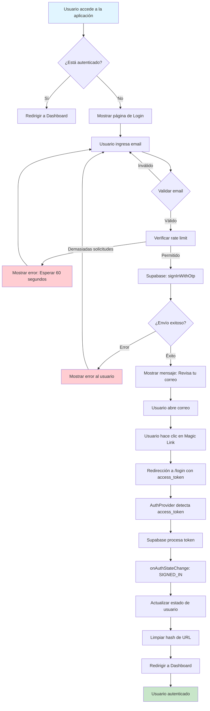
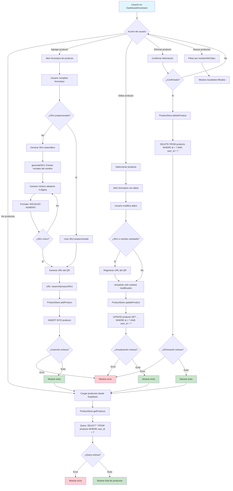
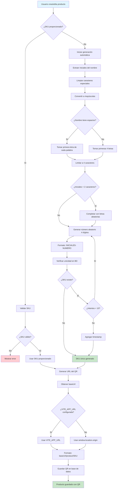
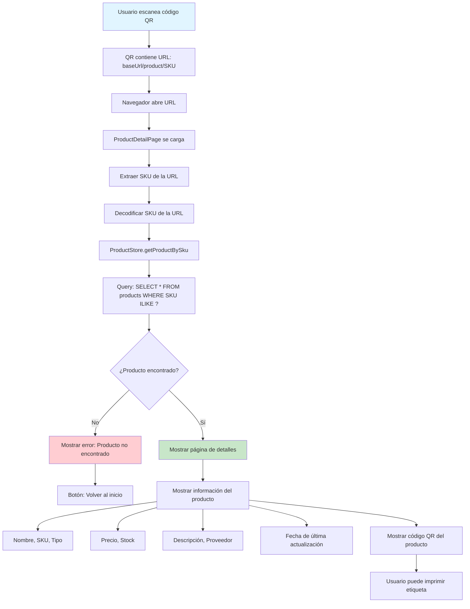
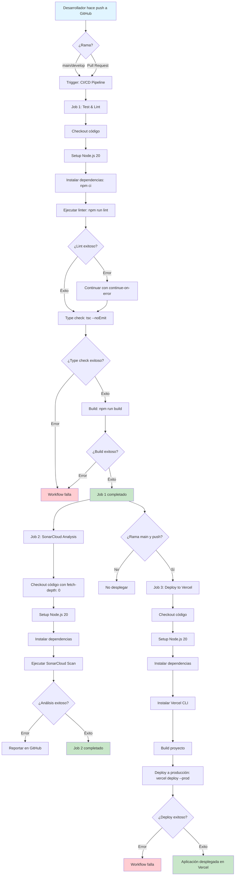
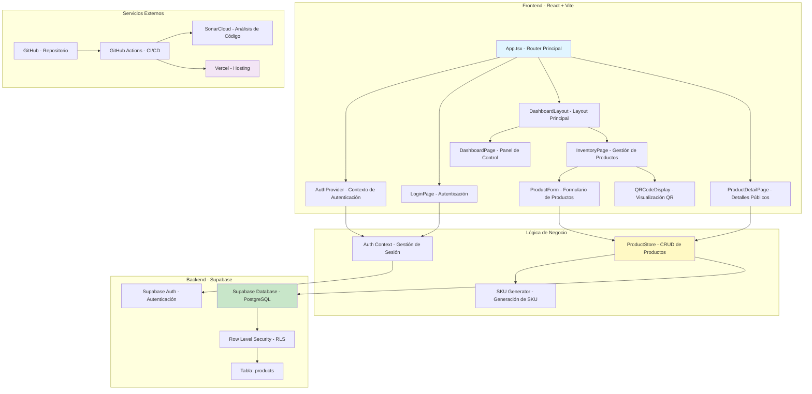
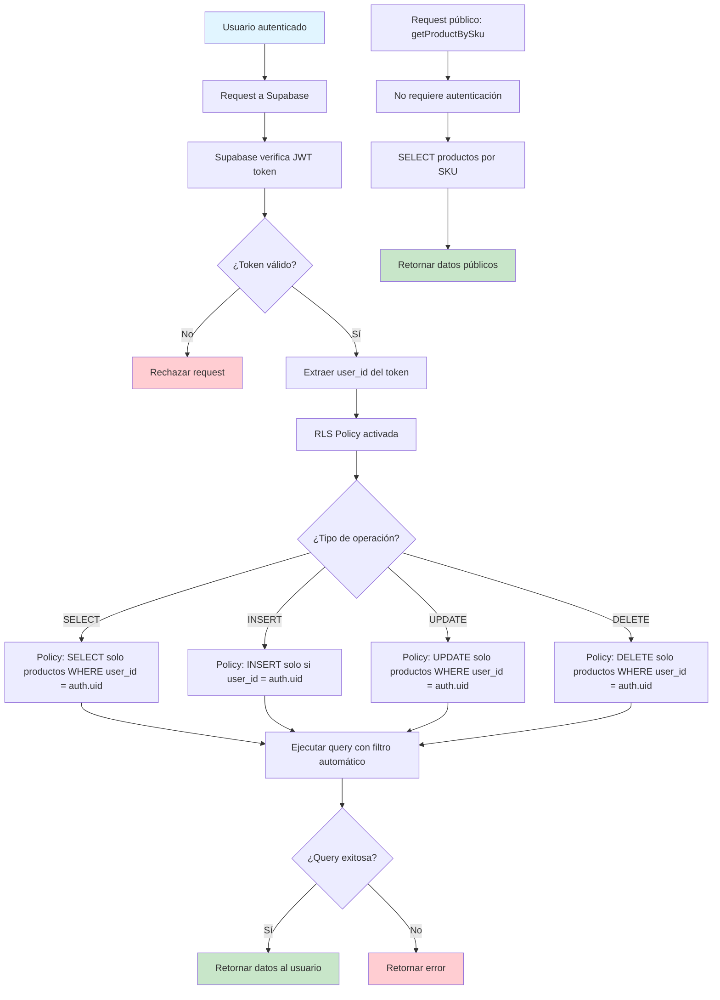

# Diagrama de Flujo del Proyecto - Café Manager

Este documento contiene los diagramas de flujo que describen el funcionamiento completo del sistema de gestión de inventario.

---

## 1. Flujo de Autenticación (Magic Link)

Este diagrama muestra el proceso completo de autenticación mediante Magic Link:



---

## 2. Flujo de Gestión de Productos (CRUD)

Este diagrama muestra el proceso completo de creación, lectura, actualización y eliminación de productos:



---

## 3. Flujo de Generación de SKU y QR

Este diagrama detalla el proceso de generación automática de SKU y códigos QR:



---

## 4. Flujo de Escaneo de Código QR

Este diagrama muestra cómo funciona el escaneo de códigos QR para ver detalles del producto:



---

## 5. Flujo de CI/CD (GitHub Actions)

Este diagrama muestra el proceso completo de integración y despliegue continuo:



---

## 6. Arquitectura General del Sistema

Este diagrama muestra la arquitectura completa del sistema y cómo interactúan todos los componentes:



---

## 7. Flujo de Navegación y Rutas

Este diagrama muestra todas las rutas de la aplicación y cómo se navega entre ellas:

```mermaid
flowchart TD
    A[Usuario accede a la aplicación] --> B{¿Autenticado?}
    
    B -->|No| C[/login - LoginPage]
    C --> D[Usuario ingresa email]
    D --> E[Magic Link enviado]
    E --> F[Usuario hace clic en link]
    F --> C
    F --> G[Autenticación exitosa]
    
    B -->|Sí| H[/dashboard - DashboardLayout]
    G --> H
    
    H --> I[/dashboard - DashboardPage]
    H --> J[/dashboard/inventory - InventoryPage]
    H --> K[/dashboard/metrics - MetricsPage]
    
    I --> L[Ver métricas generales]
    I --> J
    I --> K
    
    J --> M[Agregar producto]
    J --> N[Editar producto]
    J --> O[Eliminar producto]
    J --> P[Ver código QR]
    J --> Q[Buscar productos]
    
    P --> R[Mostrar QR en diálogo]
    R --> S[Imprimir etiqueta]
    
    T[Escaneo de QR externo] --> U[/product/:sku - ProductDetailPage]
    U --> V[Mostrar detalles públicos]
    V --> W[Mostrar QR del producto]
    
    H --> X[Cerrar sesión]
    X --> C
    
    style A fill:#e1f5ff
    style H fill:#c8e6c9
    style C fill:#fff9c4
    style U fill:#f3e5f5
```

---

## 8. Flujo de Seguridad (Row Level Security)

Este diagrama muestra cómo funciona la seguridad a nivel de fila en Supabase:



---

## Resumen de Componentes Principales

### Frontend
- **React 18**: Biblioteca de UI
- **Vite**: Build tool y dev server
- **TypeScript**: Tipado estático
- **React Router**: Enrutamiento
- **Tailwind CSS**: Estilos
- **Radix UI**: Componentes accesibles

### Backend
- **Supabase**: Backend como servicio
  - Autenticación (Magic Link)
  - Base de datos PostgreSQL
  - Row Level Security (RLS)

### CI/CD
- **GitHub Actions**: Automatización
- **SonarCloud**: Análisis de código
- **Vercel**: Hosting y deployment

### Funcionalidades Clave
1. **Autenticación sin contraseña**: Magic Link
2. **Gestión de inventario**: CRUD completo
3. **Generación automática de SKU**: Basado en nombre del producto
4. **Códigos QR**: Para acceso rápido a productos
5. **Seguridad por usuario**: RLS garantiza aislamiento de datos
6. **Deployment automático**: CI/CD completo

---

## Notas Importantes

1. **Rate Limiting**: El sistema previene spam limitando solicitudes de Magic Link a 1 por minuto
2. **SKU Único**: Se verifica la unicidad antes de asignar un SKU generado automáticamente
3. **QR Codes**: Contienen URLs que apuntan a la página de detalles del producto
4. **RLS**: Todas las operaciones de base de datos están protegidas por Row Level Security
5. **Páginas públicas**: La página de detalles del producto es accesible sin autenticación para permitir el escaneo de QR

---

*Última actualización: Enero 2025*

